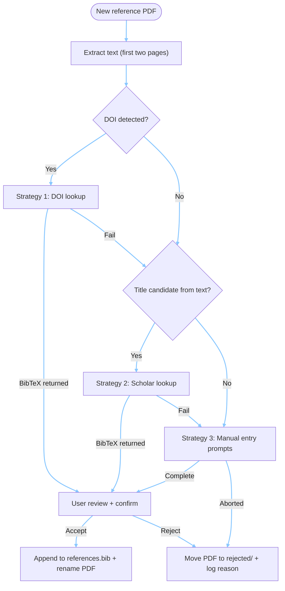

# Janus-TeX

**Two faces, one source.** Like the Roman god Janus, this LaTeX template looks both ways—generating a detailed report **and** presentation from the same content, with clickable hyperlinks between them.

## Files

| File | Purpose |
|------|----------|
| `main.tex` | Configuration, title, author, packages |
| `report_sections.tex` | Full report content |
| `presentation_slides.tex` | Slide content |
| `shared_elements.tex` | **Reusable figures/tables/equations** |
| `compile.bat` | Compilation script |
| `figures/` | Image files |

## Quick Start

1. **Compile**: `.\compile.bat` → generates `report.pdf` + `presentation.pdf`
2. **Customize** `main.tex`: title, author, institution
3. **Add content** to `report_sections.tex` and `presentation_slides.tex`
4. **Recompile**: `.\compile.bat`

## Key Feature: True Content Sharing

Define figures/tables/equations **once** in `shared_elements.tex`, use in **both** formats:

```latex
% In shared_elements.tex - define once:
\newcommand{\figureMyPlot}{\includegraphics{figures/plot.png}}
\newcommand{\tableResults}{\begin{tabular}...\end{tabular}}
\newcommand{\eqModel}{y = mx + b}

% In report - use it:
\begin{figure}
    \figureMyPlot
    \caption{...}
\end{figure}

% In presentation - same command:
\begin{frame}
    \figureMyPlot
\end{frame}
```

Change once → updates everywhere!

## GitHub Pages Hyperlinks (Optional)

1. Push to GitHub and enable Pages (Settings → Pages → main branch)
2. Update `\reporturl` in `template_main.tex` with your GitHub Pages URL
3. Recompile and push PDFs

**Result:** Slides link to specific report sections online!

To test this out download and open a copy of the `presentation.pdf` file, navigate to page 6 which references the First-Order Thermal Response Model. At the bottom of the slide there is a hyperlink: [→ Full derivation and mathematical details](https://ammarbarbee17.github.io/janus-tex/report.pdf#thermalmodel) which should bring you to the appropiate report section with the full details!

## Customization Examples

**Change theme:** Edit `\usetheme{Madrid}` in `main.tex`  
**Add section:** Copy existing section pattern in report/slides, update `\hypertarget{}`  
**Add figure:** Define `\newcommand{\figureX}{...}` in `shared_elements.tex`, use in both formats

## How It Works

`main.tex` checks `\ifdefined\ispresentation`:
- **NO** → `\documentclass{article}` → loads `report_sections.tex` → `report.pdf`
- **YES** → `\documentclass{beamer}` → loads `presentation_slides.tex` → `presentation.pdf`

Both load `shared_elements.tex` for reusable content.

## Citation Extraction Workflow

The `scripts/extract_citations.py` helper walks through multiple strategies before asking for help. The Mermaid diagram below shows when automated, LLM-assisted, or manual steps run:



- **Automated steps**: DOI fetch, Scholar lookup, renaming, rejection logging.
- **User intervention**: Manual BibTeX entry, confirmation prompts, or explicit rejection.

## PowerPoint Conversion

**Recommended method:** Use [Adobe's free PDF to PowerPoint converter](https://www.adobe.com/acrobat/online/pdf-to-ppt.html)

1. Upload `presentation.pdf` to Adobe's converter
2. Download the converted `.pptx` file
3. Clean up any formatting as needed
4. Merge with team slides in PowerPoint

## Troubleshooting

- **No pdflatex**: Install [MiKTeX](https://miktex.org)
- **Errors**: Check `.log` files
- **Hyperlinks fail**: Verify GitHub Pages URL in `\reporturl`

---

**Template v1.0** - December 2025
